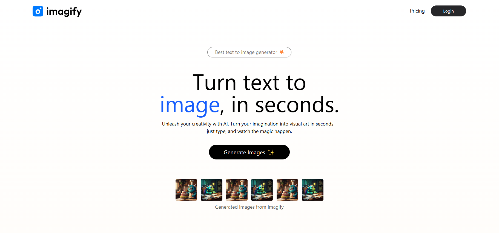
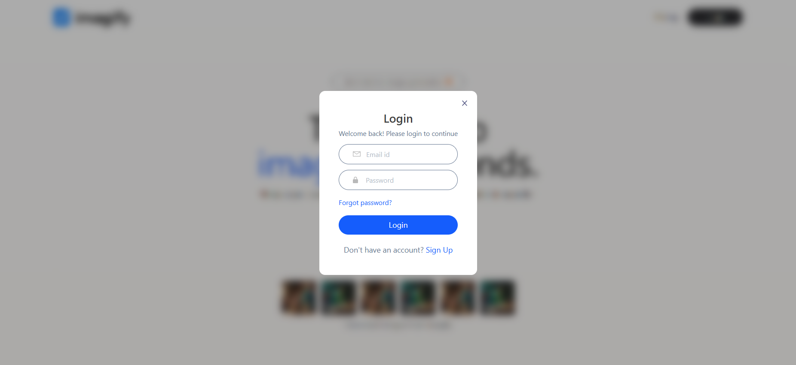
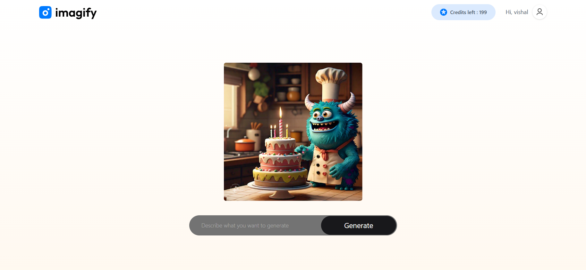
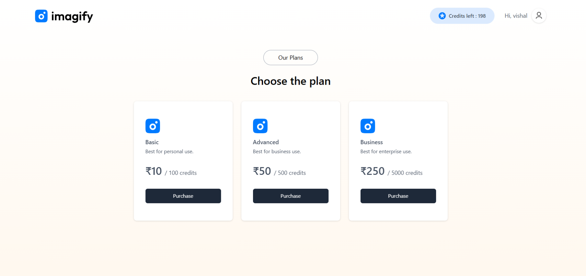
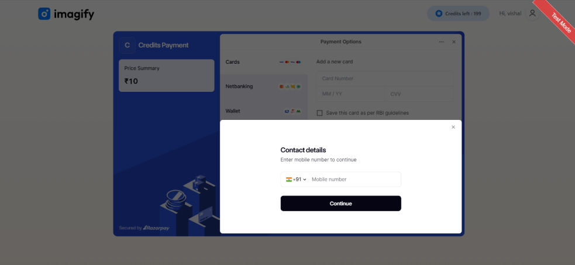

# 🎨 Imagify

AI-powered image generation web application built with the MERN stack. Generate high-quality images from text prompts using AI, purchase credits securely through Razorpay, and manage your account with JWT authentication.

---

## ✨ Features

* 🤖 AI-powered image generation from text prompts
* 🔐 Secure user authentication with JWT
* 💳 Razorpay payment gateway integration
* 🪙 Credit-based image generation system
* 📱 Responsive UI for desktop and mobile
* ☁️ MongoDB Atlas database
* ⚡ Fast React + Vite frontend
* 🔒 Protected backend APIs
* 🎯 Clean and modern user interface

---

## 📸 Screenshots

### Home Page



### Login



### Generate Image



### Generated Result


### Buy Credits



### Payment Gateway



---

# 🚀 Tech Stack

## Frontend

* React
* Vite
* Tailwind CSS
* React Router DOM
* Axios
* React Toastify

## Backend

* Node.js
* Express.js
* MongoDB Atlas
* Mongoose
* JWT Authentication
* Bcrypt
* Razorpay

## AI

* ClipDrop API

---

# 📁 Folder Structure

```text
Imagify
│
├── client
│   ├── public
│   ├── src
│   ├── .env.example
│   └── package.json
│
├── server
│   ├── config
│   ├── controllers
│   ├── middleware
│   ├── models
│   ├── routes
│   ├── .env.example
│   └── package.json
│
├── screenshots
│
├── README.md
└── .gitignore
```

---

# ⚙️ Installation

## Clone Repository

```bash
git clone https://github.com/Theangryysoul/Imagify.git

cd Imagify
```

---

## Install Dependencies

### Client

```bash
cd client
npm install
```

### Server

```bash
cd ../server
npm install
```

---

# 🔑 Environment Variables

## Client

Create `client/.env`

```env
VITE_BACKEND_URL=http://localhost:4000
VITE_RAZORPAY_KEY_ID=your_test_or_live_key
```

---

## Server

Create `server/.env`

```env
PORT=4000

MONGODB_URI=your_mongodb_connection_string

JWT_SECRET=your_jwt_secret

CLIPDROP_API=your_clipdrop_api_key

RAZORPAY_KEY_ID=your_razorpay_key

RAZORPAY_KEY_SECRET=your_razorpay_secret

CURRENCY=INR
```

---

# ▶️ Run the Project

### Start Backend

```bash
cd server
npm run server
```

### Start Frontend

```bash
cd client
npm run dev
```

Open:

```
http://localhost:5173
```

---

# 💳 Credit Plans

| Plan     | Credits | Price |
| -------- | ------: | ----: |
| Basic    |     100 |   ₹10 |
| Advanced |     500 |   ₹50 |
| Business |    5000 |  ₹250 |

---

# 💳 Payment Flow

1. User selects a credit plan.
2. Backend creates a Razorpay order.
3. Razorpay Checkout opens.
4. Payment is verified.
5. Credits are added to the user's account.
6. User can generate more AI images.

---

# 🔐 Authentication

* User Registration
* User Login
* JWT-based Authorization
* Protected API Routes
* Secure Password Hashing with bcrypt

---

# 📡 API Endpoints

## User

| Method | Endpoint                 | Description           |
| ------ | ------------------------ | --------------------- |
| POST   | `/api/user/register`     | Register a new user   |
| POST   | `/api/user/login`        | Login                 |
| GET    | `/api/user/credit`       | Get available credits |
| POST   | `/api/user/pay-razor`    | Create Razorpay order |
| POST   | `/api/user/verify-razor` | Verify payment        |

---

## Image

| Method | Endpoint                    | Description       |
| ------ | --------------------------- | ----------------- |
| POST   | `/api/image/generate-image` | Generate AI image |

---

# 📦 Environment Files

This project includes:

```
client/.env.example
server/.env.example
```

Copy them before running:

```bash
cp client/.env.example client/.env
cp server/.env.example server/.env
```

On Windows, simply copy each file and rename it to `.env`.

---

# 🚀 Future Improvements

* Google OAuth
* GitHub OAuth
* Image History
* Download History
* Prompt Templates
* Image Upscaling
* Image Variations
* User Profile
* Dark Mode
* Admin Dashboard
* Payment History

---

# 🤝 Contributing

Contributions, suggestions, and bug reports are welcome.

1. Fork the repository.
2. Create a feature branch.
3. Commit your changes.
4. Open a Pull Request.

---

# 📄 License

This project is licensed under the MIT License.

---

# 👨‍💻 Author

**Vishal Verma**

GitHub: https://github.com/Theangryysoul

If you found this project helpful, consider giving it a ⭐ on GitHub.
